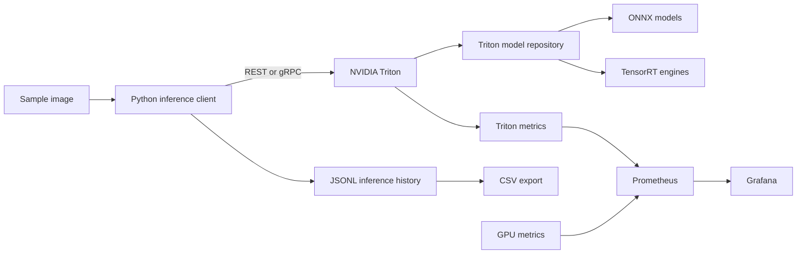
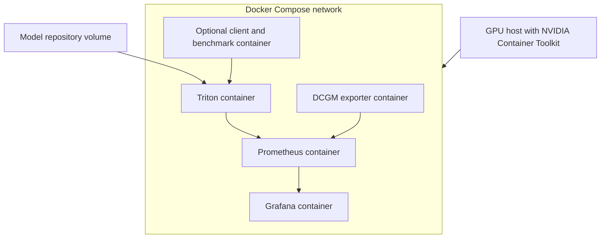
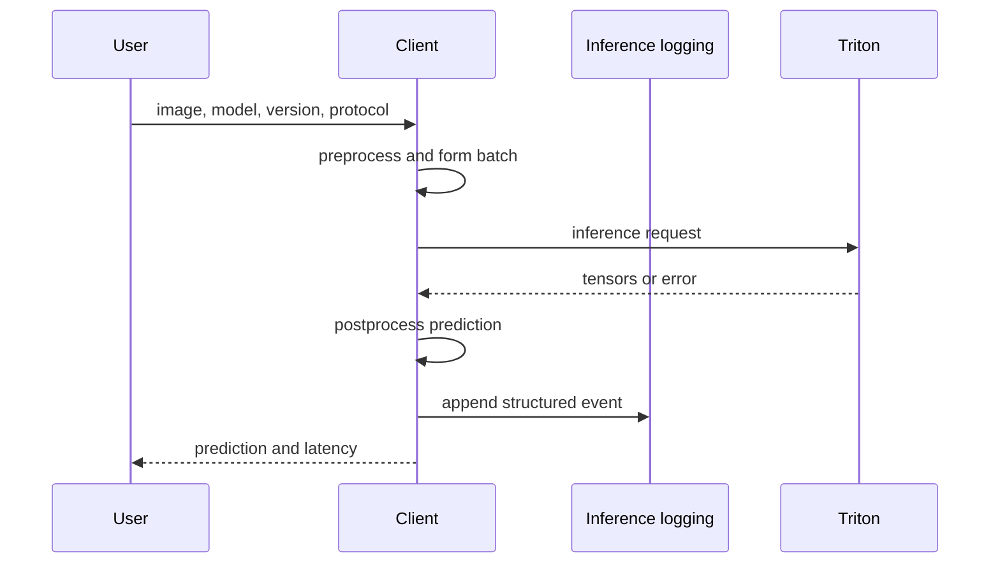
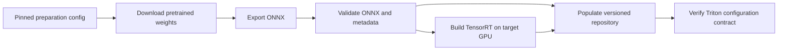

# Architecture

## Status

The repository currently contains architecture contracts and structural validation
only. Triton serving, model artifacts, deployment services, inference code,
benchmarks, and observability are planned but not implemented.

## System context

The target system serves two computer-vision workloads through NVIDIA Triton:
ImageNet classification and COCO object detection. A Python client owns
model-specific preprocessing and postprocessing. Triton owns inference scheduling,
dynamic batching, version selection, and GPU execution.

## Components

### Model preparation

- Responsibility: download pinned pretrained weights, export ONNX, build TensorRT
  engines on the target GPU, validate models, and populate the model repository.
- Inputs: preparation configuration, upstream weights, export parameters, shared
  tensor contracts, and target GPU capabilities.
- Outputs: validated ONNX files, TensorRT plans, model metadata, and checksums.
- Public entrypoint: `scripts/model_preparation/prepare_models.py` (`planned`).
- Root: `scripts/model_preparation`.
- Tests: export configuration, ONNX validation, metadata, and reproducibility checks.

### Model repository

- Responsibility: own Triton `config.pbtxt` files, version directories, and generated
  model artifacts.
- Inputs: artifacts produced by model preparation.
- Outputs: a Triton-compatible repository mounted read-only by the serving runtime.
- Public entrypoint: none; this is an artifact module.
- Root: `models`.
- Tests: repository layout, model metadata, version policy, and artifact presence.

### Triton serving

- Responsibility: expose health, repository control, metadata, REST inference, gRPC
  inference, metrics, batching, GPU instances, and version policy.
- Inputs: the model repository and shared inference contracts.
- Outputs: predictions, service health, model metadata, and Prometheus metrics.
- Public entrypoint: `deployment/scripts/run_triton.sh` (`planned`).
- Root: `deployment/triton`.
- Tests: health endpoints, metadata, explicit loading, version selection, and
  inference smoke tests.

### Deployment

- Responsibility: build, start, stop, connect, and health-check containers while
  preserving declared volumes.
- Inputs: Compose configuration, environment variables, runtime images, and service
  configuration.
- Outputs: a reproducible container network containing serving and observability
  services.
- Public entrypoint: `deployment/scripts/run_environment.sh` (`planned`).
- Root: `deployment`.
- Tests: static Compose validation and later GPU smoke tests.

### Inference client

- Responsibility: preprocess images, build Triton payloads, use REST or gRPC, parse
  predictions, render classifications or detections, and handle failures.
- Inputs: one image or a directory, model selection, version, protocol, and timeout.
- Outputs: human-readable predictions and structured inference events.
- Public entrypoint: `client/inference_client.py` (`planned`).
- Root: `client`.
- Tests: preprocessing, payload generation, transport boundaries, prediction
  parsing, batching, timeouts, and model-version selection.

### Inference logging

- Responsibility: append one JSONL event per request and export history to CSV.
- Inputs: request identity, timing, model metadata, status, prediction summary, and
  error text.
- Outputs: `logs/inference.jsonl` and `logs/inference.csv`.
- Public entrypoint: `client/logging/writer.py` (`planned`).
- Root: `client/logging`.
- Tests: schema stability, append behavior, error records, and CSV export.

### Benchmarking

- Responsibility: execute controlled load profiles and compare baseline ONNX with
  optimized TensorRT serving.
- Inputs: common images, batch sizes, concurrency, warmup, request count, and
  environment metadata.
- Outputs: raw measurements, aggregate CSV files, and a comparison report.
- Public entrypoint: `benchmarks/run_benchmark.py` (`planned`).
- Root: `benchmarks`.
- Tests: aggregation, percent-change calculations, errors, and report generation.

### Observability

- Responsibility: collect Triton, GPU, and availability metrics; provision dashboards;
  and evaluate alert rules.
- Inputs: Triton metrics, DCGM metrics, and container health.
- Outputs: Prometheus time series, Grafana dashboards, and alert states.
- Public entrypoint: `monitoring/prometheus/prometheus.yml` (`planned`).
- Root: `monitoring`.
- Tests: configuration validation, target discovery, dashboard JSON, and alert rules.

### Shared contracts

- Responsibility: define only schemas and data-transfer objects shared across module
  boundaries.
- Inputs: stable cross-module data requirements.
- Outputs: tensor metadata, request identifiers, prediction summaries, and log event
  contracts.
- Public entrypoint: `shared/contracts.py` (`planned`).
- Root: `shared`.
- Tests: serialization and backward-compatible schema behavior.

## Boundary rules

- Dependency arrows point from a consumer to the module it may use.
- `dependency-graph.json` is the only editable source for allowed and forbidden
  dependencies.
- The client may use shared contracts, Triton APIs, and inference logging.
- Benchmarking may use the public client transport but not client internals.
- Observability consumes metrics and health endpoints, not Python client code.
- Deployment controls containers but contains no model preprocessing.
- Triton consumes the model repository but does not build model artifacts at runtime.
- Shared contracts depend on no higher-level feature.

The complete generated graph is in
`docs/generated/dependency-graph.md`.

## Planned deployment

Container image versions, GPU reservation, volumes, health checks, ports, and
provisioning are deliberately deferred to the deployment scope.

## Inference sequence

## Model preparation flow

TensorRT plans are target-dependent build artifacts and are not assumed to be
portable across arbitrary GPU and runtime combinations.

## Deferred decisions

The architecture does not yet select a YOLO release, model-weight storage mechanism,
Triton or CUDA versions, base images, CI provider, GPU parameters, or benchmark
strategy. Each belongs to a later implementation scope.
