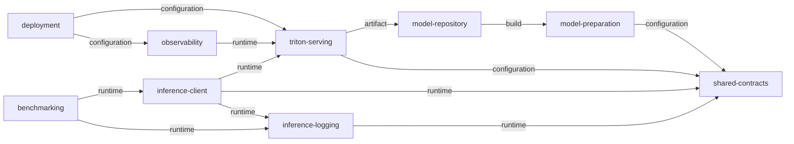
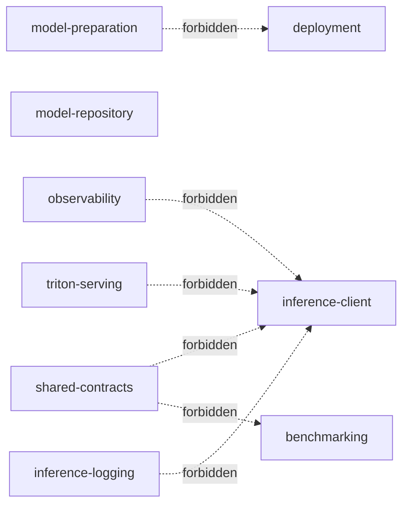

# Dependency graph

> Generated from `dependency-graph.json` by `scripts/generate_dependency_graph.py`. Do not edit manually.

An arrow points from a consumer to the module it is allowed to depend on.

## Allowed dependencies

| From | To | Type | Rationale |
| --- | --- | --- | --- |
| model-preparation | shared-contracts | configuration | Model exporters use shared tensor and metadata contracts. |
| model-repository | model-preparation | build | Repository artifacts are produced by the model preparation workflow. |
| triton-serving | model-repository | artifact | Triton loads versioned models and configuration from the model repository. |
| triton-serving | shared-contracts | configuration | Serving metadata must match shared input and output contracts. |
| deployment | triton-serving | configuration | Deployment configures and controls the Triton service. |
| deployment | observability | configuration | Deployment composes the metrics and dashboard services. |
| inference-client | triton-serving | runtime | The client calls Triton health, metadata, repository, and inference APIs. |
| inference-client | shared-contracts | runtime | The client uses shared request and prediction contracts. |
| inference-client | inference-logging | runtime | The client records one structured history event per inference. |
| inference-logging | shared-contracts | runtime | Log records use shared identifiers and prediction summaries. |
| benchmarking | inference-client | runtime | Benchmarks reuse the public Triton transport and payload boundary. |
| benchmarking | inference-logging | runtime | Benchmark requests produce the same structured inference history. |
| observability | triton-serving | runtime | Observability consumes Triton metrics and availability endpoints. |

## Forbidden dependencies

| From | To | Reason |
| --- | --- | --- |
| observability | inference-client | Observability consumes metrics and must not import client implementation. |
| shared-contracts | inference-client | Shared contracts must remain independent of application code. |
| shared-contracts | benchmarking | Shared contracts must remain independent of benchmark tooling. |
| triton-serving | inference-client | The server boundary must not depend on its client implementation. |
| model-preparation | deployment | Model preparation must remain reproducible outside runtime orchestration. |
| inference-logging | inference-client | Logging is a lower-level service and must not depend on its caller. |
